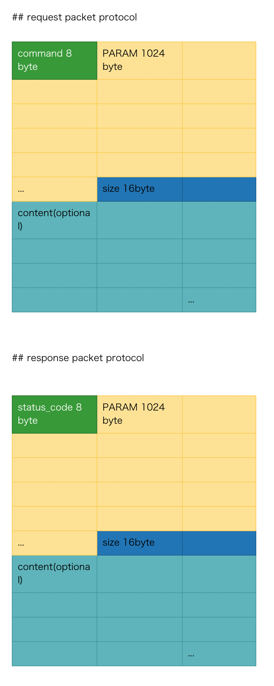

# **MiLSFP** **i**s a **L**ightweight **S**ecure **F**ile **P**ocket

# 依赖

Ubuntu 18.04 环境测试通过

- libssl 1.1
- libpam 1.1.8
- gtk3.0

# 编译方式

```
make clean
make
```

# 运行

- 配置运行server

1. 安装

```
make install
```

此过程需要输入一些信息用于生成主机证书。然后运行server

```
make addtestuser
```

添加一个测试用户，这个用户同时添加到系统账户

```
./milsd
```

> ./milsd ? 可以获取帮助

- 运行client测试

```
./mils
```

CLI交互式，可以输入命令进行操作。

```
./milsgui
```

GUI版本，可以输入命令进行操作。

# 可执行程序名称

- Server: milsd
- CLI Client: mils
- GUI Client: milsgui

# 简易报告

本程序是采用多进程Linux epoll异步IO+OpenSSL，实现的高效安全的文件服务器，具体设计：
1. 验证授权机制采用Linux PAM模块进行
2. 通信协议自主设计，具体有请求包和响应包，如下

- 请求包

```
cmd         8 bits      ------> 要执行的命令
parameter   1024 bits   ------> 命令的参数
size        16 bits     ------> 后续body的长度
body        optional    ------> 可选body部分    
```

- 响应包

```
status_code     8 bits      ------> 返回的状态码
parameter       1024 bits   ------> 返回的参数
size            16 bits     ------> 后续body的长度
body            optional    ------> 可选body部分    
```

- 图示




3. Session会话机制由C代码手工实现

4. 程序GUI界面


# 需要说明的情况

1. ~~程序核心框架已经实现。~~
2. ~~权限控制还未实现，在后续修改版本中完成并提交。~~
3. ~~只实现了CLI，GUI由于时间问题还未实现，将在后续修改版本完成并提交。~~
4. 已完成所有功能。
5. 部分验证性代码、代码规范有待整理。
